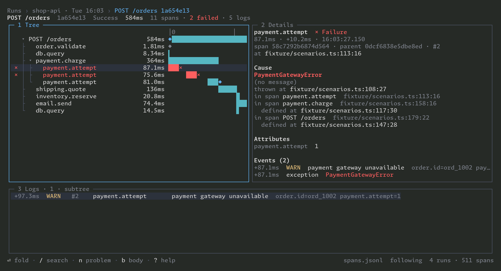

# otelscope

Record the spans of an [Effect](https://effect.website) program to a JSONL file, then browse them in the terminal.



## Packages

| Package                                                  | Path               | What it does                                                                                          |
| -------------------------------------------------------- | ------------------ | ----------------------------------------------------------------------------------------------------- |
| [`@wmaurer/otelscope-effect`](packages/effect/README.md) | `packages/effect/` | A layer that installs Effect's OTLP tracer and appends every span to a JSONL file. No collector.      |
| [`@wmaurer/otelscope`](packages/tui/README.md)           | `packages/tui/`    | The terminal viewer, bin `otelscope`. It follows the file while the program runs. Needs Node >= 26.9. |

## Quick start

Provide `JsonlTrace.layer` as the outermost layer of your program:

```ts
import { NodeServices } from "@effect/platform-node";
import { Effect } from "effect";
import { JsonlTrace } from "@wmaurer/otelscope-effect";

const program = Effect.log("hello").pipe(Effect.withSpan("greet"));

program.pipe(
    Effect.provide(JsonlTrace.layer({ serviceName: "my-app", file: "traces/spans.jsonl" })),
    Effect.provide(NodeServices.layer),
    Effect.runPromise,
);
```

Then open the file:

```sh
npx @wmaurer/otelscope traces/spans.jsonl
```

Each package's README has the full options, the record format, the keys and the query syntax.

## Development

The repository is a pnpm workspace on Node 26.9 or later. `.nvmrc` names the major version, and `.npmrc` sets
`engine-strict`, so `pnpm install` fails on older Node.

```sh
nvm use
pnpm install
pnpm pre-push
```

`pnpm pre-push` runs `fmt:check`, `lint`, `typecheck` and `test`, and the git `pre-push` hook runs it on every push.
`pnpm build` builds `dist/` in both packages. `pnpm --filter @wmaurer/otelscope perf` measures the viewer against its
performance budgets.

The viewer's spec is in [`docs/specs/span-viewer/`](docs/specs/span-viewer/README.md). [`AGENTS.md`](AGENTS.md) holds
the repository's conventions for coding agents.

## License

[MIT](LICENSE)
